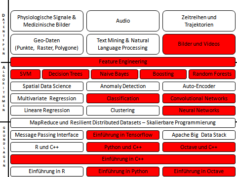

The qualification within ICAML is envisioned to be as diverse as the various disciplines we want to connect. Many of our core
qualification modules will be  available in different formats: in extended formats for beginners or very concise (TL;DR) presentation.

For now, we are working towards the completion of the first presentations of the first  modules from the following canon.
. The qualification is first organized into three levels: *Basics*, *Algorithms*, and *Case Studies*.
It is expected that people can select their modules of interest taking only into account that they are getting more and more advanced from
covering Basics with toy examples towards discussing algorithms in the context of real-world datasets.

ML Studio
------------
ML Studio is a permanent offer for those who are interested in (practical) ML topics. Here you can get information how to get started with a ML project and to test those in a hands on situation. It is a great opportunity to share your experience and to get in touch with other Machine Learners.
Feel free to recommend a ML topic you are interested in or to ask for an alternative appointment. 
<artem.leichter@ikg.uni-hannover.de>

See you every Thursday from 15:00 to 16:00 in [room 616 at Appelstraße 9A, 30167 Hannover](https://info.cafm.uni-hannover.de/room/3408.006.616).
